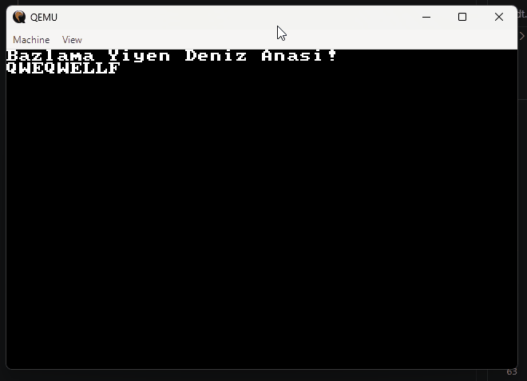
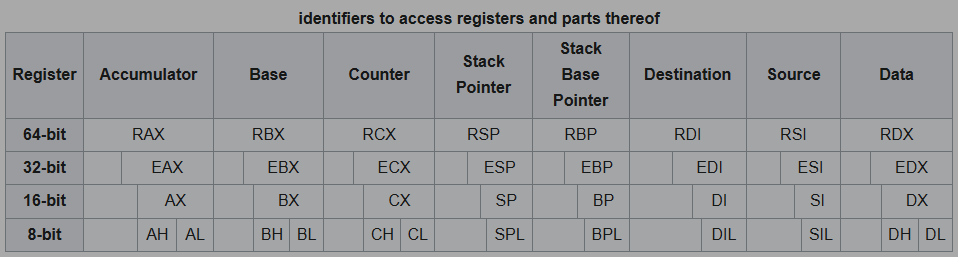

<h1>DENIZ ANASI Isletim Sistemi Gunlugu </h1>




<h2> 
Kodlari calistirmak icin gereken zimbirtilar</h2>


[emulator](https://www.qemu.org)

[x86 assembler](https://www.nasm.us)

[balenaEtcher](https://etcher.balena.io/)

Duvara cercevelenmesi gereken guzellik



<h2>Bellek Yapisi | Real Mod</h2>

```
0x0000'0000|=======================================|
           | IVT (1kb)                             |  
0x0000'0400|=======================================|
           | BIOS BDA (256 bayt)                   |
           |=======================================|

0x0000'0500|=======================================|----------------|
           |                                       |                |
0x0000'7C00|=======================================| Kullanilabilir |
           | Boot.asm (512 bayt)                   |                |
0x0000'7E00|=======================================|     Alan       |
           |           638                         |                |
           |=======================================|----------------|

0x0009'FC00|=======================================|
           | 128 KiB	EBDA  (639kb)              |
0x000A'0000|=======================================|
           | 128 KiB	Video display memory(128kb)|
           |=======================================|

0x000C'0000|========================================|------------|
           | 32 KiB (typically)	Video BIOS          |            |
0x000C'8000|========================================|            |
           | 160 KiB (typically)	BIOS Expansions |    ROM     |
0x000F'0000|========================================|            |
           | 64 KiB	Motherboard BIOS                |            |
0x000F'FFFF|========================================|------------|

```

[BIOS BDA (256 bayt)](https://flint.cs.yale.edu/feng/cos/resources/BIOS/Resources/assembly/biosdataarea.html)

[oswiki Memory_Map](https://wiki.osdev.org/Memory_Map_(x86))

[Real Mode Memory_Map](https://www.thejat.in/learn/real-mode-memory-map)

<h2>Kaynakca</h2>

[interrupt listesi](https://www.ctyme.com/rbrown.htm)

[littleosbook](https://github.com/littleosbook/littleosbook/tree/master)

[DaedalusCommunity](https://www.youtube.com/@DaedalusCommunity)

[Poncho](https://www.youtube.com/watch?v=7LTB4aLI7r0&list=PLxN4E629pPnKKqYsNVXpmCza8l0Jb6l8-&index=1)

[thejat](https://www.thejat.in/learn/os-development-1)

[oswiki](https://wiki.osdev.org/Expanded_Main_Page)

[bootloader](https://www.joe-bergeron.com/posts/Writing%20a%20Tiny%20x86%20Bootloader/)

[bootloader_lukearend](https://github.com/lukearend/x86-bootloader)
